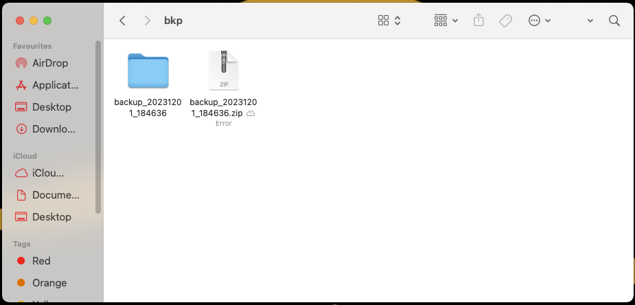

# Incremental File Backup and Recovery System
Incremental File Backup and Recovery System. This user-friendly solution prioritizes incremental backups to optimize storage and streamline recovery. Timestamped backups facilitate organized data management, ensuring users can easily trace and restore specific file versions. The intuitive interface caters to users with diverse technical backgrounds, simplifying the backup and recovery processes. Leveraging Java for cross-platform compatibility, the system employs ZIP compression for storage efficiency.

This Java program provides an incremental backup system with a graphical user interface (GUI) for easy interaction. It allows users to choose source and backup folders, perform backups, and recover files from previous backups. The program creates timestamped backup folders, ensuring multiple backups can be created over time.

System requirements : VSCode, JDK

[To Install VSCode Click Here](https://code.visualstudio.com/download)

[To Install JDK Click Here](https://www.oracle.com/java/technologies/downloads/)

1.Run the Program: Execute the Java program (IncrementalBackupUI) by running the main method. The graphical user interface (GUI) will appear.

2.Java swing UI will show this window

3.Choose Source Folder:Click on the "Choose Source Folder" button. Select the folder containing the files you want to back up.

4.Choose Backup Folder:Click on the "Choose Backup Folder" button. Select the folder where you want to store the backup files. The program will create a subfolder within this location with a timestamp.

5.Perform Backup:Click on the "Backup" button. The program will copy files from the selected source folder to a subfolder within the chosen backup folder. It will only copy files that are newer than the existing ones in the backup.

6.Check Backup:Open the chosen backup folder to verify that the new backup subfolder has been created, containing the updated or new files.

To recover a backup using the provided Java program, follow these steps:

1.Run the program: ->Execute the Java program (IncrementalBackupUI) by running the main method. The graphical user interface (GUI) will appear.

2.Choose Backup Folder: ->Click on the "Choose Backup Folder" button. Select the folder containing your backup files (the folder that was specified as the backup folder when performing the backup).

3.Recover Files: ->Click on the "Recover" button.

A dialog box will prompt you to enter the name of the backup to recover from. Enter the name without the ".zip" extension.

4.Wait for recovery: ->The program will unzip the selected backup and restore the files to the original backup folder. You will see a message dialog indicating the success or failure of the recovery process.

5.Check Recovered Files: ->Open the original backup folder to verify that the files have been successfully recovered.

